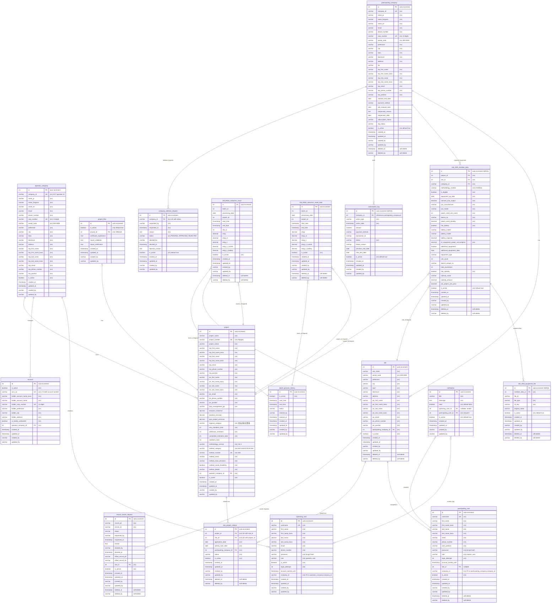

SQLの関係図

```mermaid
erDiagram
    %% <master / operator entities>
    operator_company {
        int id PK "auto-increment"
        varchar company_id UK "(nn) KCT operator ID"
        varchar name_ja "(nn)"
        varchar name_furigana "(nn)"
        varchar name_en "(nn)"
        varchar email "(nn)"
        varchar phone_number "(nn)"
        varchar corp_number UK "(nn) 13 digits"
        varchar postal_code "(nn) 000-0000"
        varchar prefecture "(nn)"
        varchar city "(nn)"
        varchar town "(nn)"
        varchar blocknum "(nn)"
        varchar address "(nn)"
        varchar rep_first_name "(nn)"
        varchar rep_first_name_kana "(nn)"
        varchar rep_last_name "(nn)"
        varchar rep_last_name_kana "(nn)"
        varchar rep_email "(nn)"
        varchar rep_phone_number "(nn)"
        varchar rep_position "(nn)"
        boolean is_active "(nn)"
        timestamp created_at
        timestamp updated_at
        varchar created_by
        varchar updated_by
    }

    operating_user {
        int id PK "auto-increment"
        varchar username UK "(nn)"
        varchar first_name "(nn)"
        varchar first_name_kana "(nn)"
        varchar last_name "(nn)"
        varchar last_name_kana "(nn)"
        varchar email "(nn)"
        varchar phone_number "(nn)"
        varchar password "(nn) bcrypt hash"
        varchar role "(nn) operator, user"
        boolean is_active "(nn)"
        int login_attempts "(nn)"
        timestamp account_locked_until
        varchar company_id "(nn) FK to operator_company.company_id"
        timestamp created_at
        timestamp updated_at
        varchar created_by
        varchar updated_by
    }

    account {
        int id PK "auto-increment"
        boolean is_active "(nn)"
        varchar acct_no UK "(nn) J-Credit account number"
        varchar holder_account_name_kana "(nn)"
        varchar holder_account_name "(nn)"
        varchar holder_corp_number UK "13 digits"
        varchar holder_prefecture "(nn)"
        varchar holder_city "(nn)"
        varchar holder_address "(nn)"
        boolean is_holder_undecided "(nn)"
        int operator_company_id FK "(nn)"
        timestamp created_at
        timestamp updated_at
        varchar created_by
        varchar updated_by
    }

    project {
        int id PK "auto-increment"
        varchar project_name "(nn)"
        varchar project_number UK "(nn) P[digits]"
        varchar project_status "(nn)"
        varchar rep_first_name "(nn)"
        varchar rep_first_name_kana "(nn)"
        varchar rep_last_name "(nn)"
        varchar rep_last_name_kana "(nn)"
        varchar rep_email "(nn)"
        varchar rep_phone_number "(nn)"
        varchar rep_position "(nn)"
        varchar pic_first_name "(nn)"
        varchar pic_first_name_kana "(nn)"
        varchar pic_last_name "(nn)"
        varchar pic_last_name_kana "(nn)"
        varchar pic_email "(nn)"
        varchar pic_phone_number "(nn)"
        varchar pic_position "(nn)"
        varchar data_management_pic "(nn)"
        decimal emission_reduction
        decimal baseline_emission
        decimal post_project_emission
        varchar regional_category "(nn) 北海道,東北,関東..."
        int new_members_total "(nn)"
        int withdrawn_members "(nn)"
        int cumulative_members_total "(nn)"
        int members_total
        varchar methodology_version "(nn) Ver.X"
        varchar method_category "(nn) EN-S,EN-R,IN,AG,WA"
        varchar method_number UK "(nn) 002"
        varchar method_name "(nn)"
        varchar method_main_emission "(nn)"
        boolean method_combi_feasibility "(nn)"
        varchar method_details "(nn)"
        int operator_company_id FK "(nn)"
        boolean is_active "(nn)"
        timestamp created_at
        timestamp updated_at
        varchar created_by
        varchar updated_by
    }

    %% <participating company & its users/sites>
    participating_company {
        int id PK "auto-increment"
        varchar company_id UK "(nn)"
        varchar name_ja "(nn)"
        varchar name_furigana "(nn)"
        varchar name_en "(nn)"
        varchar email "(nn)"
        varchar phone_number "(nn)"
        varchar corp_number UK "(nn) 13 digits"
        varchar postal_code "(nn) 000-0000"
        varchar prefecture "(nn)"
        varchar city "(nn)"
        varchar town "(nn)"
        varchar blocknum "(nn)"
        varchar address "(nn)"
        varchar fax
        varchar rep_first_name "(nn)"
        varchar rep_first_name_kana "(nn)"
        varchar rep_last_name "(nn)"
        varchar rep_last_name_kana "(nn)"
        varchar rep_email "(nn)"
        varchar rep_phone_number "(nn)"
        varchar rep_position "(nn)"
        date contract_end_date
        varchar payment_method
        date last_renewal_date
        text suspension_reason
        date suspension_date
        varchar subscription_status
        varchar reg_status
        boolean is_active "(nn) default true"
        timestamp created_at
        timestamp updated_at
        varchar created_by
        varchar updated_by
        timestamp deleted_at "soft-delete"
        varchar deleted_by "soft-delete"
    }

    site {
        int id PK "auto-increment"
        varchar site_name "(nn)"
        varchar postal_code "(nn) 000-0000"
        varchar prefecture "(nn)"
        varchar city "(nn)"
        varchar town "(nn)"
        varchar blocknum "(nn)"
        varchar address "(nn)"
        varchar pic_first_name "(nn)"
        varchar pic_first_name_kana "(nn)"
        varchar pic_last_name "(nn)"
        varchar pic_last_name_kana "(nn)"
        varchar pic_email "(nn)"
        varchar pic_phone_number "(nn)"
        varchar pic_position "(nn)"
        int participating_company_id FK "(nn)"
        boolean is_active "(nn)"
        timestamp created_at
        timestamp updated_at
        varchar created_by
        varchar updated_by
        timestamp deleted_at "soft-delete"
        varchar deleted_by "soft-delete"
    }

    site_project_relation {
        int id PK "auto-increment"
        int project_id FK "(nn) UK with site_id"
        int site_id FK "(nn) UK with project_id"
        date application_date "(nn)"
        date activity_start_date "(nn)"
        int participating_company_id FK "(nn)"
        varchar status "(nn)"
        boolean is_active "(nn)"
        timestamp created_at
        timestamp updated_at
        varchar created_by
        varchar updated_by
        timestamp deleted_at "soft-delete"
        varchar deleted_by "soft-delete"
    }

    %% <users>
    participating_user {
        int id PK "auto-increment"
        varchar username UK "(nn)"
        varchar first_name "(nn)"
        varchar first_name_kana "(nn)"
        varchar last_name "(nn)"
        varchar last_name_kana "(nn)"
        varchar email "(nn)"
        varchar phone_number "(nn)"
        varchar user_position "(nn)"
        varchar password "(nn) bcrypt hash"
        varchar role "(nn) master, user"
        int login_attempts "(nn)"
        timestamp account_locked_until
        int site_id FK "nullable"
        varchar company_id "(nn) FK to participating_company.company_id"
        boolean is_active "(nn)"
        timestamp created_at
        timestamp updated_at
        varchar created_by
        varchar updated_by
        timestamp deleted_at "soft-delete"
        varchar deleted_by "soft-delete"
    }

    %% <project files>
    project_files {
        int id PK "auto-increment"
        boolean is_active "(nn) default true"
        int project_id FK "(nn) UNIQUE"
        text certificate_registration
        text report_validation
        text report_verification
        timestamp created_at
        timestamp updated_at
        varchar created_by
        varchar updated_by
    }

    %% <solar equipment registration>
    site_r002_member_data {
        int id PK "auto-increment SERIAL"
        int project_id FK "(nn)"
        int site_id FK "(nn)"
        varchar company_id FK "(nn)"
        varchar methodology_number "(nn) CHAR(3)"
        boolean is_eligible "(nn)"
        date equipment_op_date "(nn)"
        decimal nominal_max_output "(nn)"
        varchar pcs_manufacturer "(nn)"
        varchar pcs_model "(nn)"
        int power_cond_unit_count "(nn)"
        varchar device_no "(nn)"
        decimal power_cond_standby "(nn)"
        boolean has_battery "(nn)"
        varchar battery_maker
        varchar battery_model
        decimal battery_capacity
        decimal ict_equipment_power_consumption "(nn)"
        boolean additional_equipment
        date additional_equipment_date
        varchar equipment_type
        int unit_count
        varchar device_unique_no
        int total_investment
        boolean has_subsidy "(nn)"
        varchar subsidy_name
        decimal subsidy_amount
        decimal pre_project_unit_price
        boolean is_active "(nn) default true"
        timestamp created_at
        timestamp updated_at
        varchar created_by
        varchar updated_by
        timestamp deleted_at "soft-delete"
        varchar deleted_by "soft-delete"
    }

    site_r002_equipment_file {
        int id PK "auto-increment SERIAL"
        int member_data_id FK "(nn)"
        varchar file_id
        varchar file_type "(nn)"
        varchar s3_key "(nn)"
        varchar original_name
        boolean is_active "(nn) default true"
        timestamp created_at
        timestamp updated_at
        varchar created_by
        varchar updated_by
        timestamp deleted_at "soft-delete"
        varchar deleted_by "soft-delete"
    }

    %% <batch computation results>
    EN_R002_reduction_result {
        int id PK "auto-increment"
        int batch_id
        date processing_date
        int project_id
        timestamp start_time
        timestamp end_time
        int site_id
        decimal empj
        decimal empj_m
        decimal empj_s
        decimal empj_s_control
        decimal empj_s_battery
        boolean is_active "(nn)"
        timestamp created_at
        timestamp updated_at
        varchar created_by
        varchar updated_by
        timestamp deleted_at "soft-delete"
        varchar deleted_by "soft-delete"
    }

    EN_R002_reduction_result_total {
        int id PK "auto-increment"
        int batch_id
        date processing_date
        int project_id
        timestamp start_time
        timestamp end_time
        decimal empj
        decimal empj_m
        decimal empj_s
        decimal empj_s_control
        decimal empj_s_battery
        boolean is_active "(nn)"
        timestamp created_at
        timestamp updated_at
        varchar created_by
        varchar updated_by
        timestamp deleted_at "soft-delete"
        varchar deleted_by "soft-delete"
    }

    batch_process_history {
        int id PK "auto-increment"
        boolean is_active "(nn)"
        timestamp start_time
        timestamp end_time
        varchar status
        varchar claimed_by
        timestamp claimed_at
        timestamp created_at
        timestamp updated_at
        varchar created_by
        varchar updated_by
    }

    %% <cancel / audit>
    record_cancel_request {
        int id PK "auto-increment"
        varchar record_pk "(nn)"
        varchar record_sk "(nn)"
        varchar status
        varchar requested_by
        timestamp requested_at
        text reason
        varchar decided_by
        timestamp decided_at
        varchar offset_record_pk
        varchar offset_record_sk
        int site_id FK "(nn)"
        boolean is_active "(nn)"
        timestamp created_at
        timestamp updated_at
        varchar created_by
        varchar updated_by
        timestamp deleted_at "soft-delete"
        varchar deleted_by "soft-delete"
    }

    %% <deletion request — company>
    company_deletion_request {
        int id PK "auto-increment"
        varchar company_id FK "(nn) UK with status"
        varchar requested_by "(nn)"
        timestamp requested_at "(nn)"
        text reason "(nn)"
        varchar status "(nn) PENDING, APPROVED, REJECTED"
        varchar decided_by
        timestamp decided_at
        text rejection_reason
        boolean is_active "(nn) default true"
        timestamp created_at
        timestamp updated_at
        varchar created_by
        varchar updated_by
    }

    %% <notifications & subscription>
    notification {
        int id PK "auto-increment"
        varchar title "(nn)"
        text message "(nn)"
        boolean read "(nn) default false"
        int operating_user_id FK "nullable; sender"
        int participating_user_id FK "(nn) recipient"
        boolean is_active "(nn) default true"
        timestamp created_at
        timestamp updated_at
        varchar created_by
        varchar updated_by
    }

    subscription_log {
        int id PK "auto-increment SERIAL"
        int company_id FK "references participating_company.id"
        varchar action_type "(nn)"
        timestamp action_date "(nn)"
        numeric amount
        varchar payment_method
        varchar transaction_id
        varchar status "(nn)"
        varchar failure_reason
        date previous_end_date
        date new_end_date
        boolean is_active "(nn) default true"
        timestamp created_at
        timestamp updated_at
        varchar created_by
        varchar updated_by
    }

    %% <relationships>
    operator_company ||--o{ operating_user : "employs"
    operator_company ||--o{ account : "manages"
    operator_company ||--o{ project : "owns"

    participating_company ||--o{ site : "has"
    participating_company ||--o{ site_r002_member_data : "registers equipment"
    participating_company ||--o{ subscription_log : "audit"
    participating_company ||--o{ company_deletion_request : "deletion requests"

    site ||--o{ participating_user : "assigned to"
    site ||--o{ site_project_relation : "linked from"
    site ||--o{ record_cancel_request : "cancel requests"

    project ||--o{ site_project_relation : "linked from"
    project_files |o--|| project : "has"

    site_r002_member_data ||--o{ site_r002_equipment_file : "evidence files"

    %% <logical references (no JPA FK, but columns exist)>
    EN_R002_reduction_result }o--|| project : "project_id (logical)"
    EN_R002_reduction_result }o--|| site : "site_id (logical)"
    EN_R002_reduction_result }o--|| batch_process_history : "batch_id (logical)"
    EN_R002_reduction_result_total }o--|| project : "project_id (logical)"
    EN_R002_reduction_result_total }o--|| batch_process_history : "batch_id (logical)"
    site_r002_member_data }o--|| site : "site_id (logical)"
    site_r002_member_data }o--|| project : "project_id (logical)"

    notification }o--o| operating_user : "sender (opt)"
    notification }o--|| participating_user : "recipient"
```

---

---
